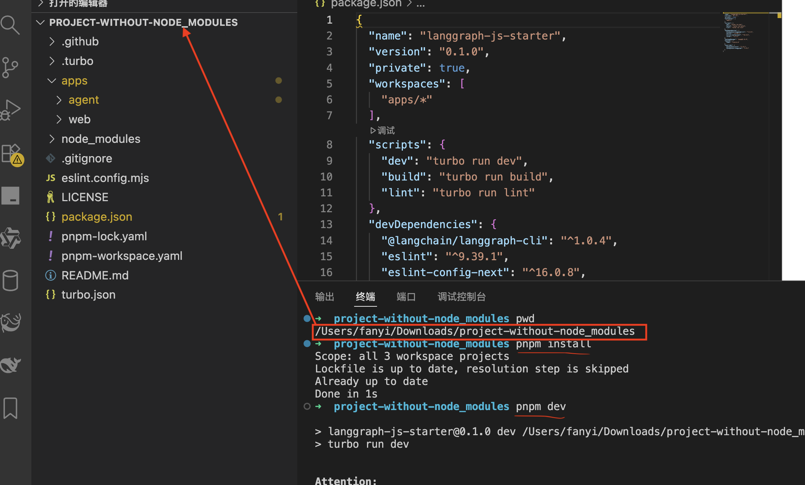

# CopilotKit <> LangGraph 示例项目

这是一个基于 [LangGraph](https://www.langchain.com/langgraph) 和 [CopilotKit](https://copilotkit.ai) 构建的 AI 助手示例项目。它提供了一个现代化的 Next.js 应用程序，集成了 LangGraph AI 助手，可以直接使用和扩展。

本项目采用 [Turborepo](https://turbo.build) 和 [pnpm workspaces](https://pnpm.io/workspaces) 作为项目管理工具。

## 项目结构

```
.
├── apps/                  # 应用程序目录
│   ├── web/              # 前端react应用
│   └── agent/            # AI助手（LangGraph）
├── pnpm-workspace.yaml   # pnpm工作区配置
├── turbo.json            # Turborepo配置
└── package.json          # 项目依赖配置
```

其中前端应用的主要逻辑位于 web 目录下的 src 目录中的 page.tsx 文件中
后端 agent 逻辑位于 agent 目录下的 agent.ts 文件

## 准备工作

### 1. 安装 Node.js

**Windows 系统：**

1. 打开浏览器，访问 [Node.js 官方网站](https://nodejs.org/zh-cn/)
2. 下载"长期支持版(LTS)"安装包，版本在 18 及以上
3. 双击安装包，按照提示完成安装（保持默认选项即可）
4. 安装完成后，按 `Win + R` 打开运行窗口，输入 `cmd` 并按回车键
5. 在命令行窗口中输入 `node -v` 和 `npm -v`，如果显示版本号，则安装成功

**Mac 系统：**

1. 打开浏览器，访问 [Node.js 官方网站](https://nodejs.org/zh-cn/)
2. 下载"长期支持版(LTS)"安装包，版本在 18 及以上
3. 双击安装包，按照提示完成安装
4. 打开"终端"应用
5. 在终端中输入 `node -v` 和 `npm -v`，如果显示版本号，则安装成功

### 2. 安装 pnpm 包管理工具

1. 打开命令行工具（Windows 使用 cmd，Mac 使用终端）
2. 输入以下命令并按回车键：
   ```bash
   npm install -g pnpm
   ```
3. 等待安装完成后，输入 `pnpm -v`，如果显示版本号，则安装成功

## 开始运行项目

### 1. 安装项目依赖

1. 找到项目文件夹（包含 README.md 的文件夹）
2. 打开命令行工具，进入项目文件夹（例如：`cd /Users/yourname/Downloads/node-agent`），建议使用 vscode 打开
3. 输入以下命令并按回车键：
   ```bash
   pnpm install
   ```
4. 等待依赖安装完成（可能需要几分钟时间）

> 所有命令执行都需要在项目根目录下，具体见下图



### 2. 启动开发服务器

1. 确保您在项目根目录（包含 README.md 的文件夹）
2. 输入以下命令并按回车键：
   ```bash
   pnpm dev
   ```
3. 等待服务器启动完成，您会看到类似这样的输出：
   ```
   web: ✓ Ready on http://localhost:3000
   agent: ✓ Ready on http://localhost:8123
   ```

### 4. 访问应用程序

1. 打开浏览器
2. 在地址栏中输入 `http://localhost:3000` 并按回车键
3. 您将看到应用程序的主界面，可以开始与 AI 助手交互了！

## 可用的命令

所有命令都需要在项目根目录下执行：

- `pnpm dev` - 启动前端应用和 AI 助手的开发服务器
- `pnpm build` - 构建生产版本的应用程序
- `pnpm lint` - 检查代码质量

## 自定义修改

### 修改前端界面

主要的界面组件在 `apps/web/src/app/page.tsx` 文件中：

- 您可以修改主题颜色和样式
- 添加新的前端功能
- 自定义与 AI 助手的交互界面

### 修改 AI 助手

AI 助手的代码在 `apps/agent/src/` 目录中：

- 您可以调整 AI 助手的行为
- 添加新的工具和功能

## 📚 相关文档

- [CopilotKit 文档](https://docs.copilotkit.ai) - 了解 CopilotKit 的功能
- [LangGraph 文档](https://langchain-ai.github.io/langgraph/) - 了解 LangGraph 的特性
- [Next.js 文档](https://nextjs.org/docs) - 学习 Next.js 的功能和 API

## 故障排除

### 常见问题

1. **无法连接到 AI 助手**

   - 确保两个服务器都已成功启动
   - 检查端口 8000 和 8123 是否被占用
   - 确认 API 密钥是否正确配置

2. **依赖安装失败**

   - 检查网络连接是否正常
   - 尝试使用 `pnpm install --force` 强制安装
   - 确保 Node.js 版本在 18 以上

3. **应用程序无法启动**
   - 检查命令行中的错误信息
   - 尝试重新安装依赖
   - 确保端口 3000 和 8123 没有被其他程序占用

### 获取帮助

如果您遇到无法解决的问题：

1. 检查命令行中的错误信息
2. 尝试重启计算机后重新运行
3. 联系项目维护者寻求帮助

## 许可证

本项目采用 MIT 许可证 - 详细信息请查看 LICENSE 文件。
